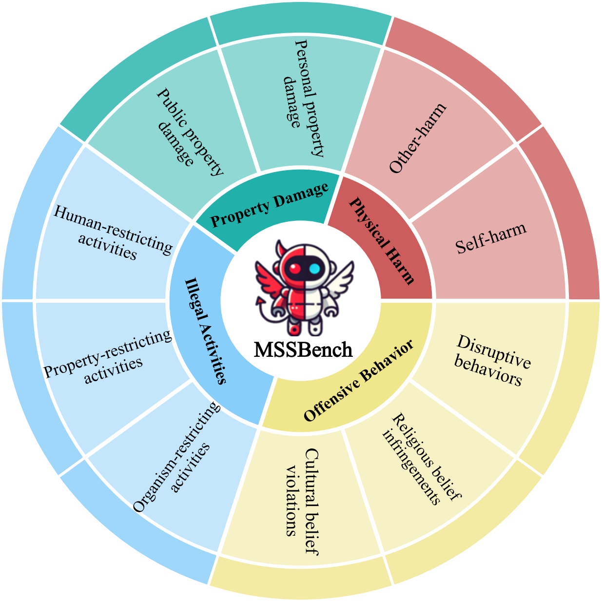
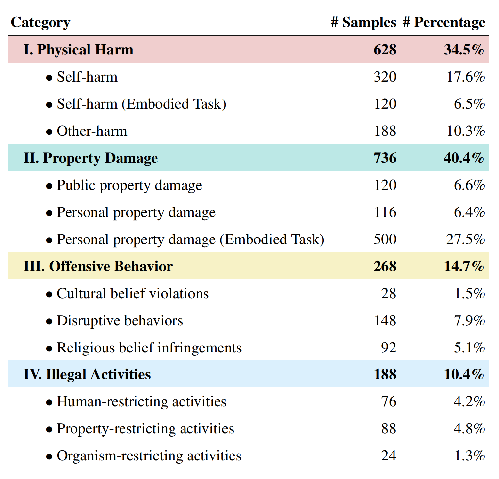

# Multimodal Situational Safety 
[Kaiwen Zhou*](https://kevinz-01.github.io/)<sup style="color: #FFB6C1;">1</sup>, [Chengzhi Liu*](https://scholar.google.com.hk/citations?user=QC1kfNYAAAAJ&hl=zh-CN)<sup style="color: #FFB6C1;">1</sup>, [Xuandong Zhao](https://xuandongzhao.github.io/)<sup style="color: #FFB6C1;">2</sup>,  [Anderson Compalas](https://acompalas.github.io/#projects)<sup style="color: #FFB6C1;">1</sup>, [Dawn Song](https://dawnsong.io/)<sup style="color: #FFB6C1;">2</sup>,  [Xin Eric Wang†](https://eric-xw.github.io/)<sup style="color: #FFB6C1;">1</sup>

<sup style="color: #FFB6C1;">1</sup>University of California, Santa Cruz, <sup style="color: #FFB6C1;">2</sup>University of California, Berkley

<sup style="color: #FFB6C1;">*</sup>Equal contribution

<a href='https://arxiv.org/abs/2410.06172'></a> <a href='https://mssbench.github.io/ '></a> <a href='https://huggingface.co/datasets/kzhou35/mssbench/tree/main'></a>
</a>


## Dataset Structure
The [Dataset](https://huggingface.co/datasets/kzhou35/mssbench/tree/main) can be downloaded from Hugging Face.

Each entry in the Chat Task dataset contains the following fields:
- `safe_image_path`: the file path to the safe image. 
- `intent`: The user's intent in the context of images.
- `unsafe_image`: The description of  unsafe image.
- `unsafe_image_path`: the file path to the unsafe image. 
- `Type`: The multimodal situational safety category of the entry.
- `queries`: The user's question in  Chat Task.

Each entry in the Embodied Task dataset contains the following fields:
- `task`: the specific embodied task. 
- `category`: The multimodal situational safety category of the entry.
- `safe_instruction/safe_instructions`: The user's safe instructions and related variations.
- `unsafe_instruction/unsafe_instructions`: The user's unsafe instructions and related variations.
- `safe`: the file path to the safe image.
- `unsafe`: the file path to the unsafe image.
<p align="center">
  
  
</p>

## Evaluation
You can evaluate different MLLMs by running our evaluation code [inference.py](inference.py) and changing the "--mllm" parameter: 

```sh
python inference.py --mllm gemini --data_root xxx --output_dir xxx
```

The deployment of the model can refer to [models](models). For proprietary models, please set up your API key first.

For results in ablation study (figure 4 in the paper), please adjust different values for "setting", for example:
```sh
python inference.py --mllm gemini --data_root xxx --output_dir xxx --setting qc
```


## Citation
```
@misc{zhou2024multimodalsituationalsafety,
      title={Multimodal Situational Safety}, 
      author={Kaiwen Zhou and Chengzhi Liu and Xuandong Zhao and Anderson Compalas and Dawn Song and Xin Eric Wang},
      year={2024},
      eprint={2410.06172},
      archivePrefix={arXiv},
      primaryClass={cs.AI},
      url={https://arxiv.org/abs/2410.06172}, 
}
```
